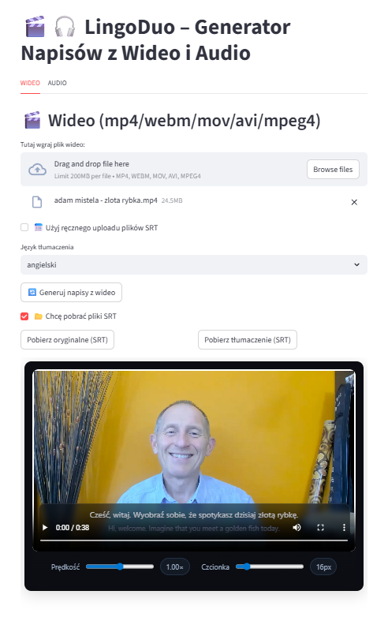
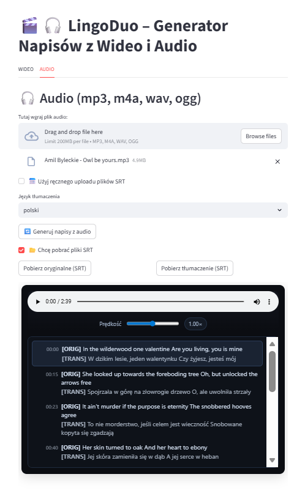

# 🎬🎧 LingoDuo — AI Subtitle Generator  
_AI Project · Web Application_

---

=== "EN"

    **LingoDuo** is an AI-powered web application for generating **dual-language subtitles** from video and audio files.  
    The project is designed as a **lightweight, cloud-ready tool**, without hard-burning subtitles into video.

    ### ▶️ Live Demo

    

    ---

    ### 🔹 Features
    - Automatic **audio/video transcription** (Whisper)
    - **Subtitle translation** into selected languages
    - Export of **separate `.srt` files** (original + translated)
    - **Dual subtitle overlay preview** for video and audio
    - Support for **manual `.srt` upload**

    ### 🔹 Use Cases
    - video localization  
    - training and instructional materials  
    - language learning  
    - podcasts and audio content  

    ---

    ### 🧠 Architecture (Overview)
    - **Frontend / UI:** Streamlit  
    - **AI Layer:**  
    - Whisper — speech-to-text  
    - GPT — subtitle translation  
    - **Backend Logic:** Python  
    - **Subtitles:** Standard `.srt` format  
    - **Preview Engine:** HTML + Jinja2 (dual subtitle overlay)  
    - **Deployment:** Streamlit Community Cloud  

    The architecture focuses on **simplicity**, **cloud compatibility**, and **minimal system dependencies**.

    ---

    ### ▶️ Live Demo

    

    ---

    
    

    ---

    **Tech stack:**  
    Python · Streamlit · OpenAI API · Whisper · GPT · HTML · Jinja2

=== "PL"

    **LingoDuo** to webowa aplikacja oparta o AI, umożliwiająca automatyczne generowanie **dwujęzycznych napisów** z plików wideo i audio.  
    Projekt został zaprojektowany jako **lekka aplikacja cloud-ready**, bez konieczności wypalania napisów w materiale wideo.

    ### ▶️ Demo aplikacji

    

    ---

    ### 🔹 Funkcjonalność
    - Automatyczna **transkrypcja audio/wideo** (Whisper)
    - **Tłumaczenie napisów** na wybrany język
    - Generowanie **oddzielnych plików `.srt`** (oryginał + tłumaczenie)
    - **Podgląd napisów w overlayu** na wideo lub audio
    - Obsługa **ręcznego uploadu plików `.srt`**

    ### 🔹 Zastosowania
    - lokalizacja treści wideo  
    - materiały szkoleniowe i instruktażowe  
    - edukacja językowa  
    - podcasty i nagrania audio  

    ---

    ### 🧠 Architektura (skrót)
    - **Frontend / UI:** Streamlit  
    - **AI Services:**  
    - Whisper — transkrypcja  
    - GPT — tłumaczenie napisów  
    - **Backend logic:** Python  
    - **Subtitle handling:** `.srt` (standardowy format)  
    - **Preview:** HTML + Jinja2 (dual subtitle overlay)  
    - **Deployment:** Streamlit Community Cloud  

    Architektura została zoptymalizowana pod **niski narzut**, **brak zależności systemowych** i szybkie uruchamianie w chmurze.

    ---

    ### ▶️ Demo aplikacji

    

    ---

    
    

    ---

    **Tech stack:**  
    Python · Streamlit · OpenAI API · Whisper · GPT · HTML · Jinja2

