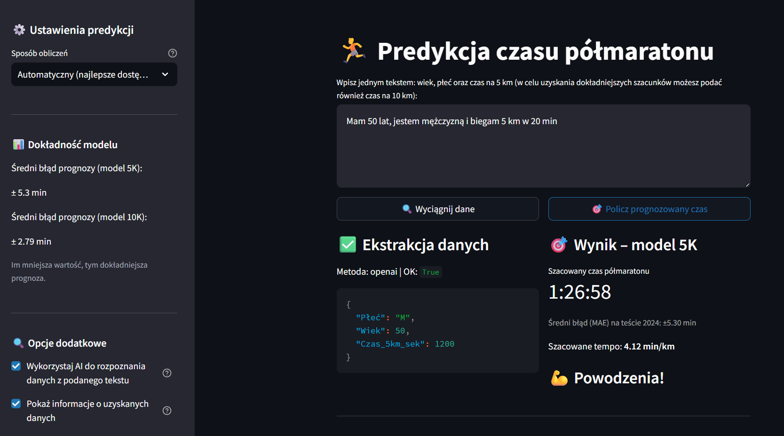

# 🏃 Half-Marathon Time Predictor  
_AI Project · ML Inference Web Application_

---

=== "EN"

    **Half-Marathon Time Predictor** is an AI-powered web application for **estimating half-marathon finish time**
    using data available **before race day** (*pre-race inference*).

    The project demonstrates a **production-grade machine learning pipeline**, from data validation and model
    versioning to real-time inference in a cloud-deployed Streamlit application.
    The models were trained based on data from the Wrocław Half Marathon in 2023 and 2024.

    ### ▶️ Live Demo

    

    ---

    ### 🔹 Key Features
    - **Pre-race time prediction** (no data leakage)
    - Two complementary ML models:
      - **5K-based baseline model**
      - **5K + 10K enhanced model**
    - **Automatic model selection** based on available input data
    - Free-text input with **LLM-based data extraction**
    - **Regex fallback** when LLM is unavailable
    - **Strict schema validation** (Pandera)
    - Realistic **pace visualization (km-by-km)**

    ### 🔹 Use Cases
    - race time estimation before competition  
    - training goal setting  
    - performance benchmarking  
    - ML system design reference (pre-race inference)  

    ---

    ### 🧠 Models (Overview)

    **PRE_RACE_5K**
    - Inputs: sex, age, 5 km time  
    - Designed for minimal input scenarios  
    - MAE ≈ **5 minutes** on 2024 test data  

    **PRE_RACE_10K**
    - Inputs: sex, age, 5 km time, 10 km time  
    - More accurate pacing representation  
    - Lower prediction error than 5K-only model  

    The application **automatically selects** the optimal model based on provided data.

    ---

    ### 🧠 Architecture (Overview)
    - **Frontend / UI:** Streamlit  
    - **ML Layer:** PyCaret (scikit-learn)  
    - **Input Validation:** Pandera + JSON schema  
    - **LLM Extraction:** OpenAI API (optional)  
    - **Monitoring:** Langfuse (optional)  
    - **Model Distribution:** GitHub Releases  
    - **Deployment:** Streamlit Community Cloud  

    The architecture emphasizes **data correctness**, **versioned inference**, and
    **safe handling of partially specified user input**.

    ---

    ### 📓 Training Notebook

    

    ---

    ### ▶️ Live Demo

    

    ---

    

    ---

    **Tech stack:**  
    Python · Streamlit · PyCaret · scikit-learn · Pandera · OpenAI API · Langfuse · GitHub Releases

=== "PL"

    **Half-Marathon Time Predictor** to aplikacja oparta o AI, służąca do **szacowania czasu ukończenia półmaratonu**
    na podstawie danych dostępnych **przed startem biegu** (*pre-race inference*).

    Projekt prezentuje **produkcyjny pipeline ML**, obejmujący walidację danych,
    wersjonowanie modeli oraz inferencję w aplikacji webowej.
    Modele zostały wytrenowane w oparciu o dane z Półmaratonu Wrocławskiego z lat 2023 i 2024.

    ### ▶️ Demo aplikacji

    

    ---

    ### 🔹 Funkcjonalność
    - Predykcja czasu biegu **przed startem** (bez data leakage)
    - Dwa modele predykcyjne:
      - **model bazowy (5 km)**
      - **model rozszerzony (5 km + 10 km)**
    - **Automatyczny wybór modelu**
    - Jedno pole tekstowe jako wejście
    - Ekstrakcja danych przez **LLM**
    - **Regex fallback** przy braku LLM
    - Walidacja danych przez **Pandera**
    - Realistyczna **wizualizacja tempa km-po-km**

    ### 🔹 Zastosowania
    - estymacja wyniku przed zawodami  
    - planowanie celów treningowych  
    - porównanie formy biegowej  
    - przykład architektury ML pre-race  

    ---

    ### 🧠 Modele (skrót)

    **PRE_RACE_5K**
    - Dane wejściowe: płeć, wiek, czas 5 km  
    - Minimalne wymagania wejściowe  
    - MAE ≈ **5 minut** (test 2024)  

    **PRE_RACE_10K**
    - Dane wejściowe: płeć, wiek, czas 5 km, czas 10 km  
    - Lepsze odwzorowanie tempa zawodnika  
    - Niższy błąd predykcji niż wariant 5 km  

    Aplikacja **automatycznie dobiera model** na podstawie dostępnych danych.

    ---

    ### 🧠 Architektura (skrót)
    - **Frontend / UI:** Streamlit  
    - **Warstwa ML:** PyCaret (scikit-learn)  
    - **Walidacja danych:** Pandera + schema JSON  
    - **Ekstrakcja danych:** OpenAI API (opcjonalnie)  
    - **Monitoring:** Langfuse (opcjonalnie)  
    - **Dystrybucja modeli:** GitHub Releases  
    - **Wdrożenie:** Streamlit Community Cloud  

    Architektura została zaprojektowana z naciskiem na
    **spójność danych**, **bezpieczną inferencję** i **łatwe wersjonowanie modeli**.

    ---

    ### 📓 Notebook treningowy

    

    ---

    ### ▶️ Demo aplikacji

    

    ---

    

    ---

    **Stack technologiczny:**  
    Python · Streamlit · PyCaret · scikit-learn · Pandera · OpenAI API · Langfuse · GitHub Releases
